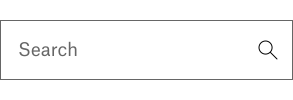
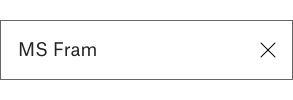
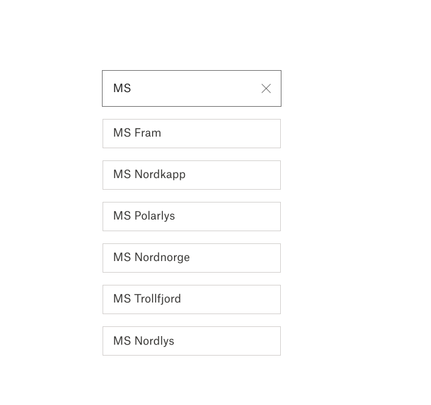

# Exercise 1 - User interface

Build an user interface that matches the design below.



Create a component with styling to match the design
Icons are located in the `src/assets/` folder.

**TIP** Responsive layout and accessibility

# Exercise 2 - State management

Extend the user interface you created in previous exercise to manage state.



Implement state management for the search and replace the magnifying glass with a button to clear the form input

# Exercise 3 - Search

For this exercise we have created a backend API that returns a list of Hurtigruten's ships. When the server is running (`npm run server`) you can query the `/api/ships` endpoint. If you want to find ships with a name that contains `amundsen` you can provide the search query as an url parameter:



```
curl -s http://localhost:4000/api/ships/amundsen
```

Extend your application to perform a search when the user presses enter. List the result below the search bar, as shown below.

**TIP** There is something missing from the server...

# Exercise 4 - Search as you type

Pressing the magnifying glass to perform a search is exhausting.

Implement functionality to search as you type.

**TIP** Performing a search for each character change might be overkill. Consider implementing some performance optimization.
